# Clustering Report

## Scores

| Model                        | Silhouette | Calinski-Harabasz | Davies-Bouldin |
|------------------------------|-------------|-------------------|----------------|
| KMeans                       | 0.5480      | 12366.4374        | 0.7560         |
| AgglomerativeClustering_Ward | 0.4083      | 10769.3204        | 0.9373         |
| AgglomerativeClustering_Avg  | 0.5384      | 8167.2413         | 0.6199         |

## Plots

### Elbow Plot

The elbow plot shows the distortion (sum of squared distances to the nearest cluster center) for different values of the number of clusters for the KMeans algorithm. The optimal number of clusters is usually at the 'elbow' of the plot, where the distortion starts to decrease more slowly.

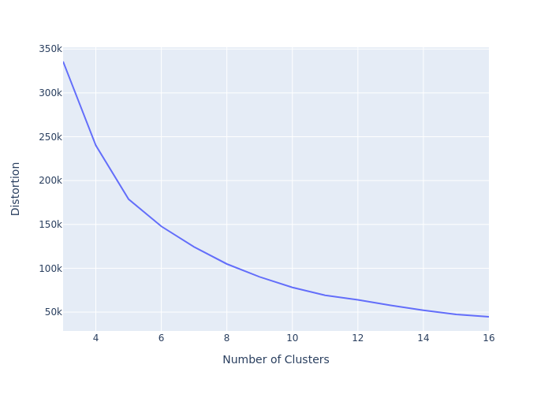

### Dendrogram Plot

The dendrogram plot shows the hierarchical clustering of the data using the AgglomerativeClustering algorithm with Ward linkage. The x-axis shows the data points and the y-axis shows the distance between clusters. The horizontal lines represent the merging of two clusters. The optimal number of clusters can be determined by cutting the dendrogram at a specific height.

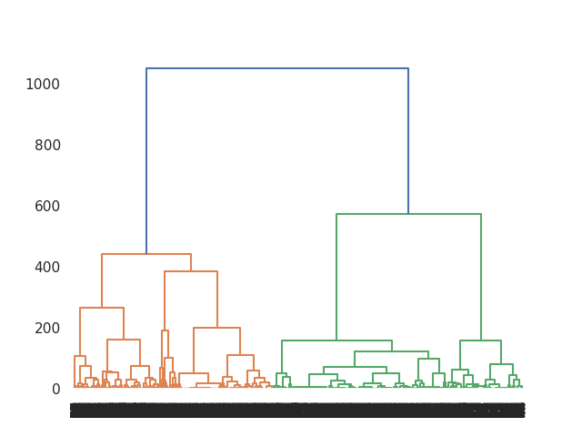

### KMeans

#### Cluster Plot

The cluster plot shows the geographical distribution of the clusters for the KMeans algorithm. Each color represents a different cluster.

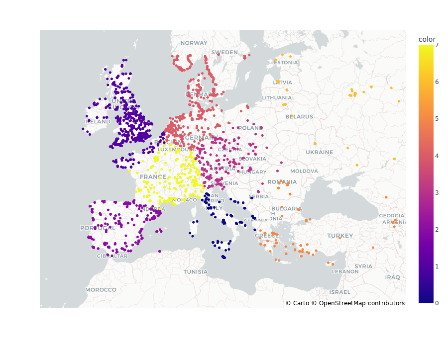

#### Cluster Counts Plot

The cluster counts plot shows the number of data points in each cluster for the KMeans algorithm.

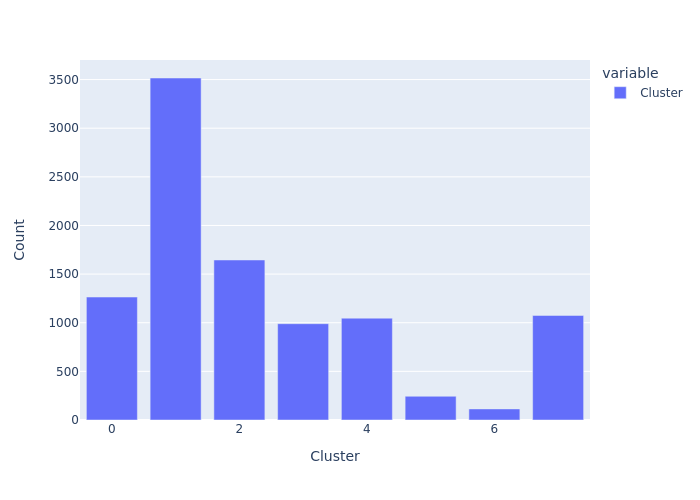

#### Cluster Pie Chart

The cluster pie chart shows the proportion of data points in each cluster for the KMeans algorithm.

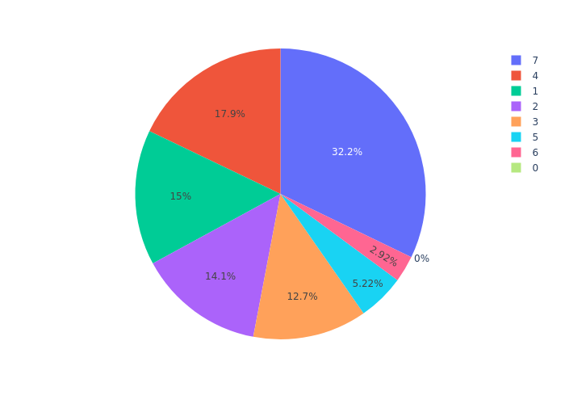

### AgglomerativeClustering_Ward

#### Cluster Plot

The cluster plot shows the geographical distribution of the clusters for the AgglomerativeClustering_Ward algorithm. Each color represents a different cluster.

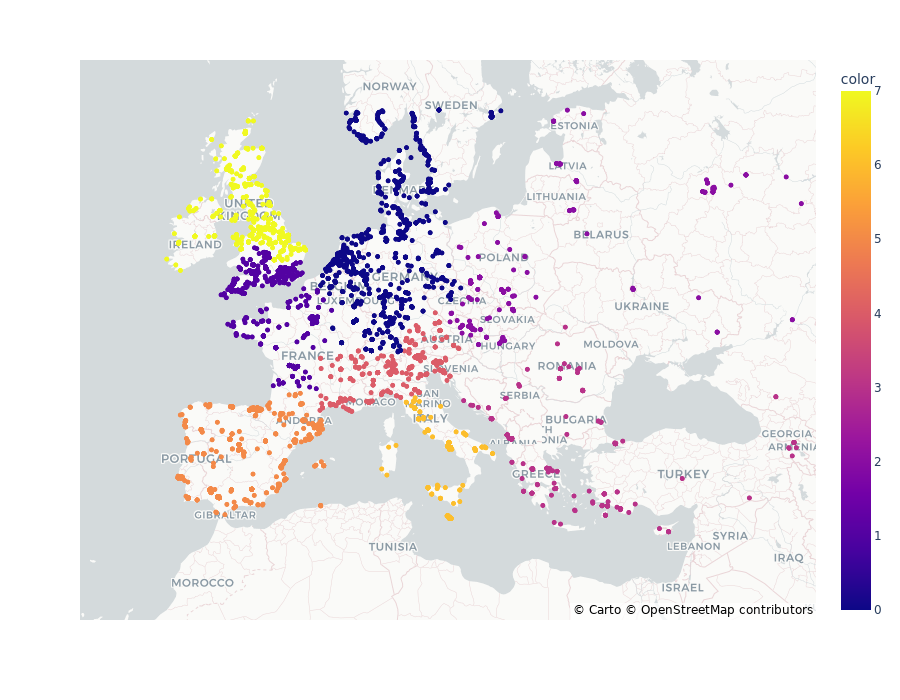

#### Cluster Counts Plot

The cluster counts plot shows the number of data points in each cluster for the AgglomerativeClustering_Ward algorithm.

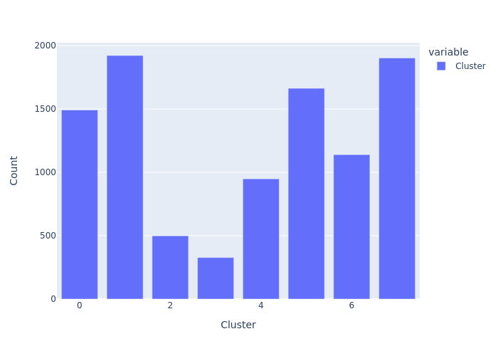

#### Cluster Pie Chart

The cluster pie chart shows the proportion of data points in each cluster for the AgglomerativeClustering_Ward algorithm.

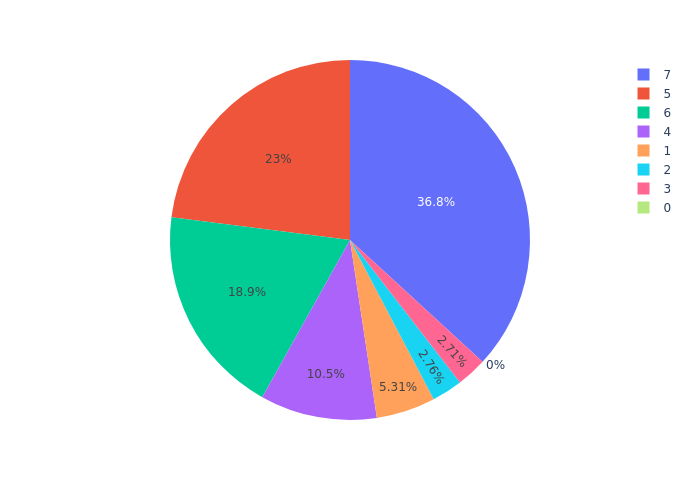

### AgglomerativeClustering_Average

#### Cluster Plot

The cluster plot shows the geographical distribution of the clusters for the AgglomerativeClustering_Average algorithm. Each color represents a different cluster.

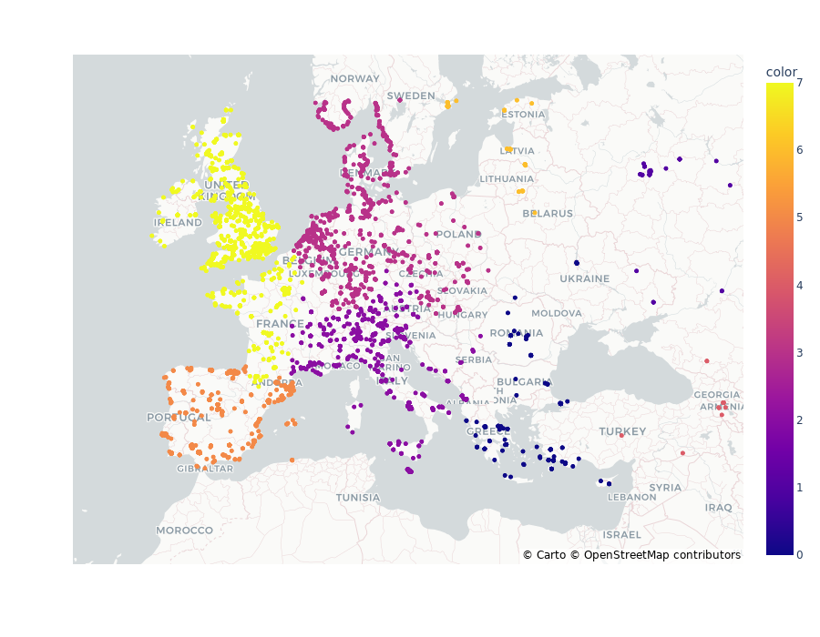

#### Cluster Counts Plot

The cluster counts plot shows the number of data points in each cluster for the AgglomerativeClustering_Average algorithm.

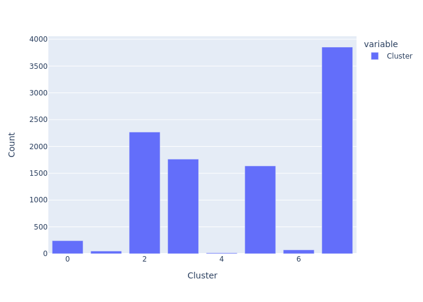

#### Cluster Pie Chart

The cluster pie chart shows the proportion of data points in each cluster for the AgglomerativeClustering_Average algorithm.

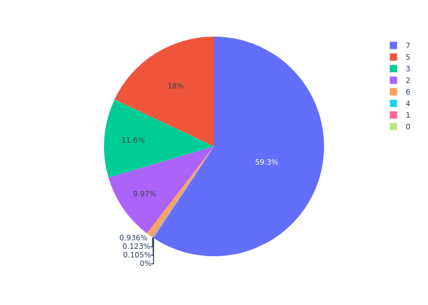

